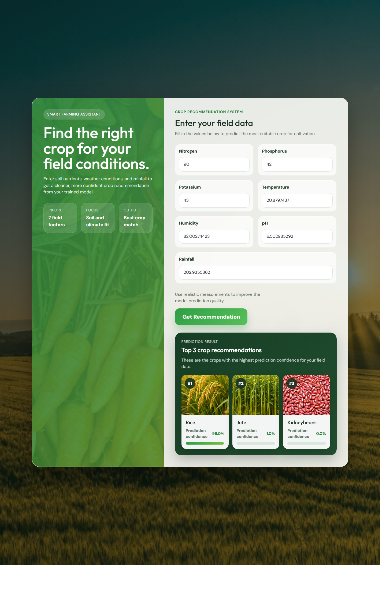

# Crop Recommendation System

## Overview
This project is a machine learning based crop recommendation system built with Python, Flask, and scikit-learn. It predicts the most suitable crop from soil and environmental conditions entered by the user.

The system uses the following input features:
- Nitrogen (`N`)
- Phosphorus (`P`)
- Potassium (`K`)
- Temperature
- Humidity
- pH
- Rainfall

The predicted output is one of 22 crop classes, such as Rice, Coconut, Mango, Coffee, and others.

## Main Components
- `app.py`: Flask application for loading the trained model, accepting form input, running prediction, and showing the result.
- `templates/index.html`: User interface for entering field values and displaying the recommended crop.
- `Crop Classification With Recommendation System.ipynb`: Jupyter notebook used for dataset review, feature analysis, preprocessing, model comparison, and training.
- `Crop_recommendation.csv`: Dataset used for training and evaluation.
- `model.pkl`, `minmaxscaler.pkl`, `standscaler.pkl`: Saved model and preprocessing artifacts.
- `static/crops/`: Local crop images shown in the result card.

## Dataset Summary
The dataset contains:
- `2200` rows
- `8` columns
- `7` input features
- `1` target column: `label`

Dataset quality checks in the notebook showed:
- no missing values
- no duplicate rows
- balanced classes, with `100` samples for each crop

## Machine Learning Workflow
The notebook performs the following steps:
- load and inspect the dataset
- check data types, null values, and duplicates
- analyze feature ranges and class distribution
- encode crop labels into numeric classes
- split the dataset into training and testing sets
- scale the features using `MinMaxScaler` and `StandardScaler`
- train and compare multiple classification algorithms
- save the final trained model and scaler files for deployment

Models compared in the notebook include:
- Logistic Regression
- Gaussian Naive Bayes
- Support Vector Machine
- K-Nearest Neighbors
- Decision Tree
- Random Forest
- Bagging
- AdaBoost
- Gradient Boosting
- Extra Trees

## Web Application Features
- simple form-based crop recommendation
- input validation for required numeric fields
- prediction result displayed in the UI
- crop-specific image support from the local `static/crops` folder
- automatic fallback to `default` crop image if a specific one is missing
- automatic rebuilding of model artifacts from the dataset if incompatible pickle files are detected

## Application Preview


## Project Structure
```text
.
├── app.py
├── Crop Classification With Recommendation System.ipynb
├── Crop_recommendation.csv
├── model.pkl
├── minmaxscaler.pkl
├── standscaler.pkl
├── requirements.txt
├── templates/
│   └── index.html
└── static/
    └── crops/
```

## Installation
Open the project folder in PowerShell or the VS Code terminal, then install the dependencies:

```powershell
& "C:\Users\user\AppData\Local\Programs\Python\Python312\python.exe" -m pip install -r requirements.txt
```

If `python` works normally on your machine, this also works:

```powershell
python -m pip install -r requirements.txt
```

## Run the Application
Start the Flask app with:

```powershell
& "C:\Users\user\AppData\Local\Programs\Python\Python312\python.exe" app.py
```

Then open:

```text
http://127.0.0.1:5001
```

## Crop Images
Crop result images are loaded from `static/crops/`.

The app supports these file extensions:
- `.png`
- `.jpg`
- `.jpeg`
- `.webp`

Use the crop name as the image filename. Examples:
- `rice.png`
- `coconut.png`
- `mango.png`
- `coffee.png`

If a crop image is not found, the app falls back to a default image.

Expected crop image base names:
- `rice`
- `maize`
- `jute`
- `cotton`
- `coconut`
- `papaya`
- `orange`
- `apple`
- `muskmelon`
- `watermelon`
- `grapes`
- `mango`
- `banana`
- `pomegranate`
- `lentil`
- `blackgram`
- `mungbean`
- `mothbeans`
- `pigeonpeas`
- `kidneybeans`
- `chickpea`
- `coffee`

## Notes
- The web app predicts one crop label from 7 user inputs.
- The model artifacts can be regenerated automatically from the CSV if older pickle files are incompatible with the installed scikit-learn version.
- The current Flask setup uses `debug=True`, which is fine for development but should be changed before deployment.

## Requirements
Dependencies are listed in [`requirements.txt`](/c:/Users/user/Downloads/Lecture%20Slides%20of%20Semesters/Spring26%20-%20261/CSE299%20-%20Junior%20Design/Crop-Recommendation-System-Using-Machine-Learning-main/Crop-Recommendation-System-Using-Machine-Learning-main/requirements.txt):
- Flask
- NumPy
- Pandas
- scikit-learn

