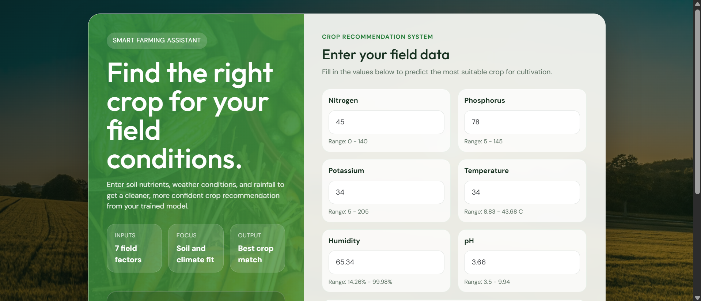
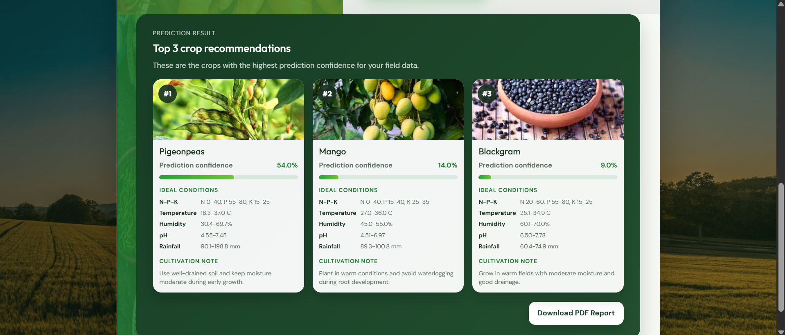
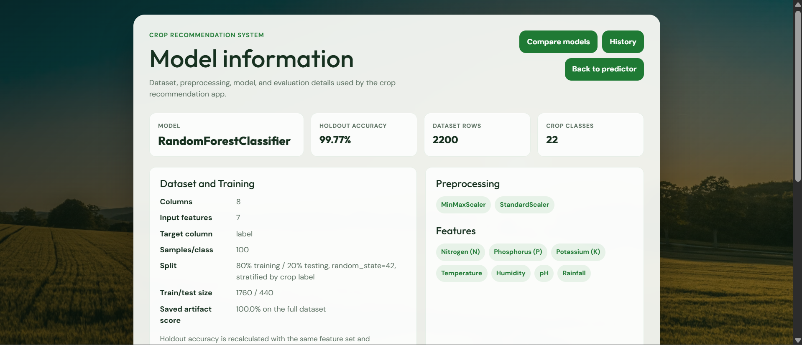
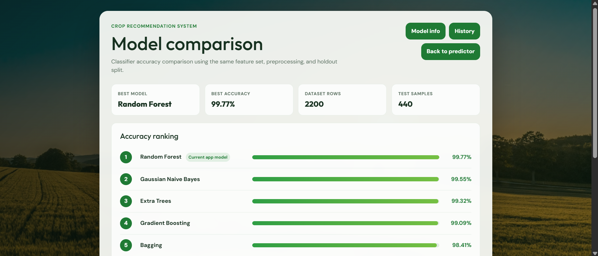
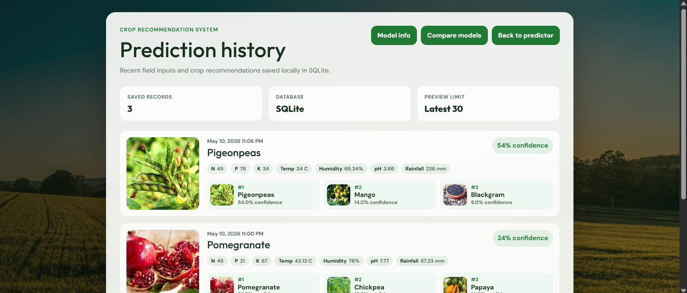

# Crop Recommendation System

## Overview
This project is a machine learning based crop recommendation system built with Python, Flask, SQLite, and scikit-learn. It predicts suitable crops from soil nutrients and environmental measurements entered by the user.

The app now returns a richer recommendation result instead of only one crop name. It shows the top 3 crops, confidence scores, crop images, ideal growing conditions, cultivation notes, downloadable PDF reports, model analysis pages, and saved prediction history.

## Input Features
The model uses 7 input features:

- Nitrogen (`N`)
- Phosphorus (`P`)
- Potassium (`K`)
- Temperature
- Humidity
- pH
- Rainfall

The predicted output is one of 22 crop classes, including Rice, Maize, Coconut, Papaya, Mango, Coffee, and others.

## Main Features
- Top 3 crop recommendations
- Confidence score for each crop
- Crop image preview for each recommendation
- Ideal growing conditions for each crop
- Short cultivation note for each crop
- Input range hints based on the CSV dataset
- Backend validation that blocks unrealistic values such as invalid pH values
- Downloadable PDF recommendation report
- SQLite prediction history
- Separate Prediction History page with crop images and saved inputs
- Model Information page with dataset, preprocessing, model, accuracy, and feature importance
- Model Comparison page with classifier accuracy ranking
- Automatic fallback crop image if a crop-specific image is missing
- Automatic model/scaler rebuild from the CSV if saved pickle files are incompatible

## Application Pages
After running the Flask app, these routes are available:

```text
http://127.0.0.1:5001/
http://127.0.0.1:5001/model-info
http://127.0.0.1:5001/model-comparison
http://127.0.0.1:5001/prediction-history
```

The main predictor page includes quick navigation buttons for:

- Model Info
- Compare Models
- History

## Application Screenshots

### 1. Home Page


### 2. Prediction Result


### 3. Model Information Page


### 4. Model Comparison Page


### 5. Prediction History Page


## Dataset Summary
The dataset contains:

- `2200` rows
- `8` columns
- `7` input features
- `1` target column: `label`
- `22` crop classes
- `100` samples per crop class

Dataset quality checks showed:

- no missing values
- no duplicate rows
- balanced crop classes

## Accepted Input Ranges
The app displays these ranges under the input fields and validates them before prediction:

| Field | Accepted range |
| --- | --- |
| Nitrogen | 0 - 140 |
| Phosphorus | 5 - 145 |
| Potassium | 5 - 205 |
| Temperature | 8.83 - 43.68 C |
| Humidity | 14.26% - 99.98% |
| pH | 3.5 - 9.94 |
| Rainfall | 20.21 - 298.56 mm |

These limits come from `Crop_recommendation.csv`.

## Machine Learning Workflow
The notebook performs the following steps:

- load and inspect the dataset
- check data types, null values, and duplicates
- analyze feature ranges and class distribution
- encode crop labels into numeric classes
- split the dataset into training and testing sets
- scale features using `MinMaxScaler` and `StandardScaler`
- train and compare multiple classification algorithms
- save the final trained model and scaler files for Flask deployment

Models compared include:

- Logistic Regression
- Gaussian Naive Bayes
- Support Vector Machine
- K-Nearest Neighbors
- Decision Tree
- Random Forest
- Bagging
- AdaBoost
- Gradient Boosting
- Extra Trees

## Recommendation Output
For every successful prediction, the app shows:

- top 3 crop matches
- prediction confidence percentage
- crop image
- N-P-K, temperature, humidity, pH, and rainfall ideal ranges
- cultivation note
- PDF report download button

The PDF report includes:

- entered field values
- generated date and time
- top crop recommendations
- confidence scores
- ideal conditions
- cultivation notes

## Prediction History
Prediction history is stored locally in SQLite.

The app creates this database file automatically:

```text
prediction_history.db
```

Each saved prediction stores:

- date and time
- entered N, P, K, temperature, humidity, pH, and rainfall values
- top recommended crop
- confidence score
- top 3 recommendation details

The history can be viewed at:

```text
http://127.0.0.1:5001/prediction-history
```

The SQLite database file is ignored by Git using `.gitignore`, so local history does not get pushed to GitHub.

## Project Structure
```text
.
|-- app.py
|-- Crop Classification With Recommendation System.ipynb
|-- Crop_recommendation.csv
|-- model.pkl
|-- minmaxscaler.pkl
|-- standscaler.pkl
|-- requirements.txt
|-- README.md
|-- Screenshots/
|   |-- Home-page.png
|   |-- prediction-result.png
|   |-- Model-info-page.png
|   |-- compare-models-page.png
|   `-- prediction-history-page.png
|-- templates/
|   |-- index.html
|   |-- model_info.html
|   |-- model_comparison.html
|   `-- prediction_history.html
`-- static/
    `-- crops/
```

Generated locally:

```text
prediction_history.db
```

## Installation
Open the project folder in PowerShell or the VS Code terminal, then install the dependencies:

```powershell
python -m pip install -r requirements.txt
```

If your machine needs the full Python path, use:

```powershell
& "C:\Users\user\AppData\Local\Programs\Python\Python312\python.exe" -m pip install -r requirements.txt
```

## Run the Application
Start the Flask app:

```powershell
python app.py
```

Or with the full Python path:

```powershell
& "C:\Users\user\AppData\Local\Programs\Python\Python312\python.exe" app.py
```

Then open:

```text
http://127.0.0.1:5001
```

## Crop Images
Crop result images are loaded from `static/crops/`.

Supported file extensions:

- `.png`
- `.jpg`
- `.jpeg`
- `.webp`

Use the crop name as the image filename. Examples:

- `rice.png`
- `coconut.png`
- `mango.png`
- `coffee.png`

If a crop image is not found, the app falls back to a default image.

Expected crop image base names:

- `rice`
- `maize`
- `jute`
- `cotton`
- `coconut`
- `papaya`
- `orange`
- `apple`
- `muskmelon`
- `watermelon`
- `grapes`
- `mango`
- `banana`
- `pomegranate`
- `lentil`
- `blackgram`
- `mungbean`
- `mothbean`
- `pigeonpeas`
- `kidneybeans`
- `chickpea`
- `coffee`

## Requirements
Dependencies are listed in `requirements.txt`:

- Flask
- NumPy
- Pandas
- scikit-learn

SQLite is used through Python's built-in `sqlite3` module, so no extra package is required for prediction history.

## Notes
- The app is configured for local development at `127.0.0.1:5001`.
- `debug=True` is useful during development but should be disabled before deployment.
- The recommendation is decision support only. Real farming decisions should also consider local agronomy advice, soil tests, market conditions, and seasonal context.
